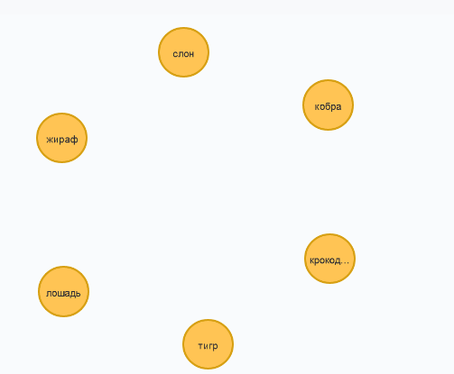
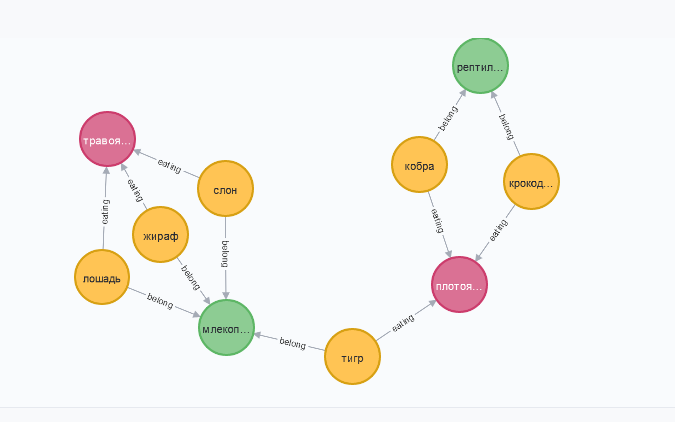
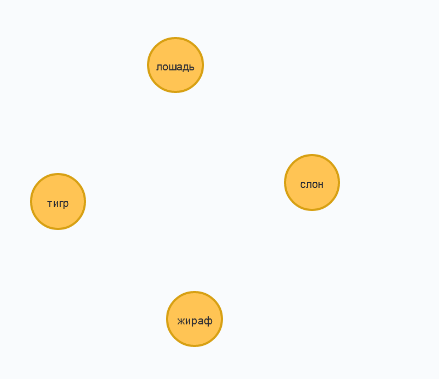
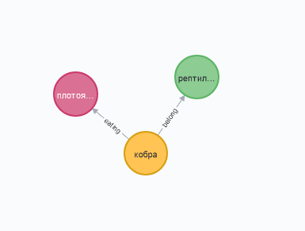
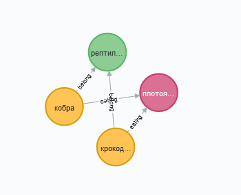
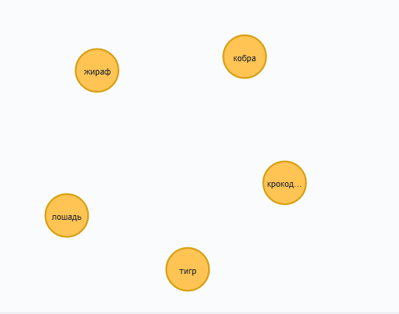
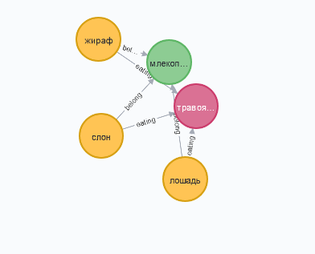
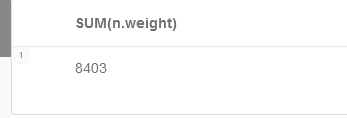
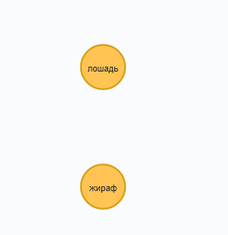
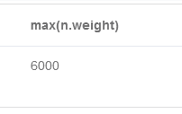

# Лабораторная работа №3

В качестве предметной области выбраны животные у каждого из них есть название и масса, а также принадлежность к млекопитающим либо рептилиям, и травоядным или плотоядным.

## Команды для создания сущностей

CREATE  
(tiger:animal{name:"тигр",weight:300}),      
(crocodile:animal{name:"крокодил",weight:500}),   
(cobra:animal{name:"кобра",weight 3}),          
(elephant:animal{name:"слон",weight:6000}),  
(giraffe:animal{name:"жираф",weight:800}),  
(horse:animal{name:"лошадь",weight:800}),  
(herbivorous:eating{name:"травоядное"}),  
(carnivorous:eating{name"плотоядное"}),  
(mammal:class{name:"млекопитающее"}),  
(reptile:class{name:"рептилия"}),  
(tiger)-[:eating{name:"питание"}]->(carnivorous),  
(crocodile)-[:eating{name:"питание"}]->(carnivorous),  
(cobra)-[:eating{name:"питание"}]->(carnivorous),  
(elephant)-[:eating{name:"питание"}]->(herbivorous),  
(giraffe)-[:eating{name:"питание"}]->(herbivorous),  
(horse)-[:eating{name:"питание"}]->(herbivorous),  
(tiger)-[:belong{name:"принадлежать"}]->(mammal),  
(elephant)-[:belong{name:"принадлежать"}]->(mammal),  
(giraffe)-[:belong{name:"принадлежать"}]->(mammal),  
(horse)-[:belong{name:"принадлежать"}]->(mammal),  
(cobra)-[:belong{name:"принадлежать"}]->(reptile),  
(crocodile)-[:belong{name:"принадлежать"}]->(reptile)  

## Команды для поиска в базе
1) Найти всех животных   
MATCH (n:animal) RETURN n  

2) Найти всех животных и их отношения  
MATCH (n:animal)-[r]->(m) RETURN (n)-[r]->(m)  
  
3) Найти всех млекопитающих  
MATCH (n:animal)-[r:belong]->(m) WHERE m.name="млекопитающее" RETURN n  
  
4) Вывести информацию о кобре  
MATCH (n:animal)-[r]->(m) WHERE n.name="кобра" RETURN n,m  
  
5) Все плотоядные рептилии  
MATCH (n:animal)-[r:eating]->(m),(n:animal)-[k:belong]->(p) WHERE m.name="плотоядное" AND p.name="рептилия" RETURN n,m,p  
  
6) Все животные легче 1000 кг  
MATCH (n:animal) WHERE n.weight<1000 RETURN n  
  
7) Травоядные млекопитающие > 500  
MATCH (n:animal)-[r:belong]->(m),(n:animal)-[k:eating]->(p) WHERE m.name="млекопитающее" AND p.name="травоядное"AND n.weight>500 RETURN n,p,m  
  
8) Масса всех животных  
MATCH (n:animal) RETURN SUM(n.weight)  
  
9) Найти животных с одинаковой массой  
MATCH (n:animal),(m:animal) WHERE m.weight=n.weight AND m.name<>n.name RETURN n,m  
  
10) Найти наибольшую массу  
MATCH (n:animal) RETURN MAX(n.weight)  
  
